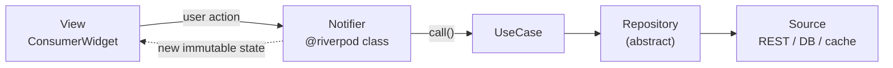

# MVN — Model-View-Notifier

[](https://marketplace.visualstudio.com/items?itemName=CleanArchitectureandMVNwithRiverPod.clean-architecture-riverpod-mvn)
[](LICENSE)

**MVN is an architecture pattern for Flutter where the bridge between the View and the Model is a Riverpod `Notifier`, not a "ViewModel" or a "Controller".**

The name matches the class you actually write, so "we use MVN" tells a team exactly what to build.

📖 **Full guide:** [abdelrahman-abied.github.io/mvn-architecture-pattern](https://abdelrahman-abied.github.io/mvn-architecture-pattern/) · ✍️ **Article:** [Beyond MVVM: Introducing the MVN pattern](https://medium.com/@abied.abiad/beyond-mvvm-introducing-the-model-view-notifier-mvn-pattern-for-flutter-with-riverpod-2b123e28f26a)

## How it flows



| Layer | Responsibility | Riverpod component |
| --- | --- | --- |
| **Model** | Data, business logic, data fetching (entities, use cases, repositories, sources) | `@riverpod` providers |
| **Notifier** | Holds the feature's UI state, updates it, connects Model and View | `@riverpod class … extends _$…` |
| **View** | Renders state, forwards user actions to the Notifier, no business logic | `ConsumerWidget` |

## Why MVN instead of MVVM

| | MVVM in Flutter | MVN with Riverpod |
| --- | --- | --- |
| Core component | An abstract "ViewModel"; the implementation varies (ChangeNotifier, Bloc, …) | A concrete Riverpod `Notifier`, so the name says what to write |
| State exposure | Varies; often Streams or `ValueNotifier` | One immutable `sealed` state, managed by Riverpod |
| Team convention | "We use MVVM, and our ViewModels are Riverpod Notifiers" | "We use MVN" |

MVN doesn't replace MVVM. It's MVVM written in Riverpod's own terms, with nothing to translate.

## Folder structure

Every feature uses this tree. Folder names are singular.

```
lib/features/<feature>/
├── domain/          # pure Dart: no Flutter, no data imports
│   ├── entities/
│   ├── repositories/   # abstract contracts
│   └── usecases/       # one intent per use case
├── data/            # implements domain contracts
│   ├── models/         # request / response DTOs + toEntity()
│   ├── repositories/   # <feature>_repository_impl.dart
│   └── sources/        # remote / local data sources
└── presentation/    # MVN lives here
    ├── notifier/
    ├── state/
    ├── view/
    └── widget/
```

Dependencies point inward: `presentation → domain ← data`.

## Example: the presentation layer

**State:** a sealed class, so the View's `switch` is checked for every case at compile time.

```dart
@immutable
sealed class MovieState {
  const MovieState();
}

final class MovieInitial extends MovieState { const MovieInitial(); }
final class MovieLoading extends MovieState { const MovieLoading(); }
final class MovieSuccess extends MovieState {
  final List<MovieEntity> movies;
  const MovieSuccess(this.movies);
}
final class MovieError extends MovieState {
  final String message;
  const MovieError(this.message);
}
```

**Notifier:** calls use cases and maps the result to state. It never touches widgets or `BuildContext`.

```dart
@riverpod
class MovieNotifier extends _$MovieNotifier {
  @override
  MovieState build() => const MovieInitial();

  Future<void> loadTrending() async {
    state = const MovieLoading();
    try {
      final movies = await ref.read(fetchTrendingMoviesProvider)();
      state = MovieSuccess(movies);
    } catch (e) {
      state = MovieError(e.toString());
    }
  }
}
```

**View:** renders state with an exhaustive `switch` and handles one-time events with `ref.listen`.

```dart
class MovieView extends ConsumerWidget {
  const MovieView({super.key});

  @override
  Widget build(BuildContext context, WidgetRef ref) {
    ref.listen<MovieState>(movieNotifierProvider, (_, current) {
      if (current is MovieError) {
        ScaffoldMessenger.of(context)
            .showSnackBar(SnackBar(content: Text(current.message)));
      }
    });

    return switch (ref.watch(movieNotifierProvider)) {
      MovieInitial() => ElevatedButton(
          onPressed: ref.read(movieNotifierProvider.notifier).loadTrending,
          child: const Text('Load'),
        ),
      MovieLoading() => const Center(child: CircularProgressIndicator()),
      MovieError(message: final m) => Center(child: Text(m)),
      MovieSuccess(movies: final list) => MovieList(movies: list),
    };
  }
}
```

The full `movie` feature, including the entity, use case, repository and source, is in the [reference template](https://github.com/abdelrahman-abied/mvn-architecture-skill/blob/main/mvn-architect/skills/mvn/SKILL.md).

## Rules

- Classes in `notifier/` end in `Notifier`. No `Controller`, `ViewModel` or `VM` naming.
- One-time side effects (snackbars, navigation, sheets) go in `ref.listen` in the View, never as booleans in state.
- When one notifier depends on another, `ref.watch` it inside `build()` so Riverpod re-runs it on change.
- Use `.select()`, or split the screen into smaller `ConsumerWidget`s, to keep rebuilds small.
- Providers use `@riverpod` code generation (Riverpod 3): no `StateNotifierProvider` or `ChangeNotifier`.

## Tooling

| Tool | What it does |
| --- | --- |
| [VS Code extension](https://marketplace.visualstudio.com/items?itemName=CleanArchitectureandMVNwithRiverPod.clean-architecture-riverpod-mvn) | Right-click a folder to generate a feature's Clean Architecture + MVN structure and starter files |
| [Claude Code plugin](https://github.com/abdelrahman-abied/mvn-architecture-skill) | Teaches Claude Code to write, review and refactor code that follows MVN |

```bash
claude plugin marketplace add abdelrahman-abied/mvn-architecture-skill
claude plugin install mvn-architect@mvn-architecture
```

## Author

Created by **Abdulrahman Mohamed (Abied)**, Mobile Solution Architect · [LinkedIn](https://www.linkedin.com/in/abdelrahman-mohammed-abied) · [Medium](https://medium.com/@abied.abiad)

## License

[Apache 2.0](LICENSE)
